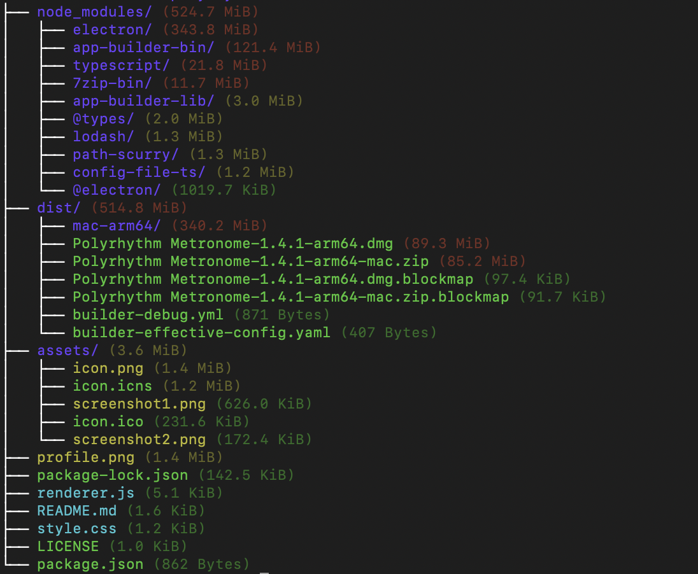

# dtree

**A CLI tool that displays disk usage as a colorful, detailed tree view**

* Folders and files are colorcoded by file type and size.
* Supports depth and entry limiting, sorting and hidden file inclusion.

<p align="center">
  
  
</p>

---

## Installation

Using [`pipx`](https://pypa.github.io/pipx/) for isolated installation:

To install pipx, follow the [official pipx instructions](https://github.com/pypa/pipx):

```bash
# Install the CLI tool
pipx install disk-tree-cli
```
The dtree command should work now.

## Usage

```bash
dtree [OPTIONS] [PATH]
```

* **`PATH`**: directory to scan (default: current directory).

### Options

| Flag                            | Description                                                    |
| ------------------------------- | -------------------------------------------------------------- |
| `-h`, `--help`                  | Show help message and exit                                     |
| `--version`                     | Print version information and exit                             |
| `-d`, `--depth <N>`             | Maximum tree depth (default: `3`)                              |
| `-l`, `--limit <N>`             | Maximum entries per directory (default: `10`)                  |
| `-s`, `--sort {size,name,type}` | Sort entries by **size** (default), **name**, or **type**      |
| `-a`, `--all`                   | Include hidden files and directories (those starting with `.`) |

* **Sorting behavior**:

  * `size`: largest items first (descending).
  * `name`: alphabetical by name.
  * `type`: directories first, then by file extension, then name.

---

## Examples

* **Default scan** (depth 3, limit 10, size‑sorted):

  ```bash
  dtree
  ```

* **Scan a specific folder**:

  ```bash
  dtree /path/to/project
  ```

* **Only top level, up to 5 items**:

  ```bash
  dtree -d 1 -l 5 ~/projects
  ```

* **Deeper view, show hidden, alphabetical sort**:

  ```bash
  dtree --depth 5 --limit 20 --all --sort name .
  ```

* **Full info**:

  ```bash
  dtree -h
  ```

---

## License

This project is licensed under the MIT License.
